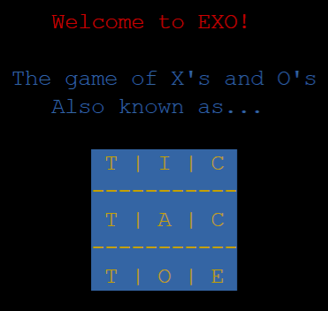
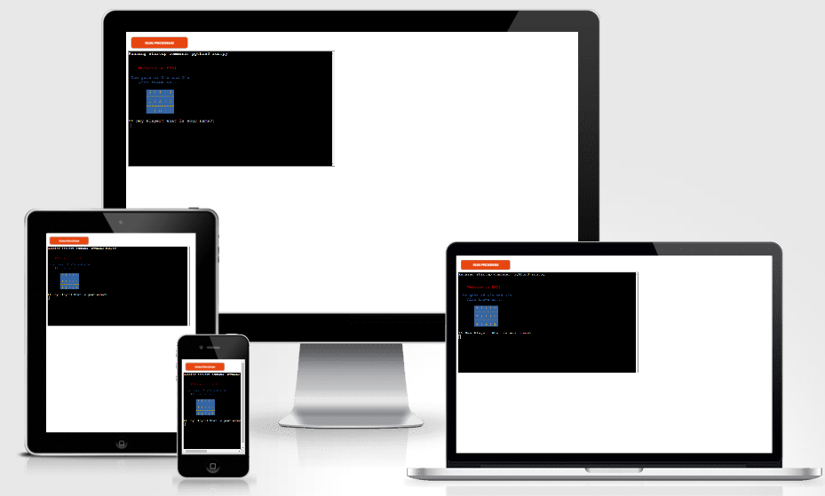

# EXO!

EXO! is a command line tic-tac-toe game written in Python.

Users take it in turns against the computer to get three in a row, each time there is a winner or a tie the score board is displayed.

## Game Play

* You are given a display of 3 by 3 squares, total of 9
* You, the player, must give your name
* You are always player X
* The computer is always player O
* You are prompted to give your first choice of squares
* The aim of the game is to achieve three squares in a row