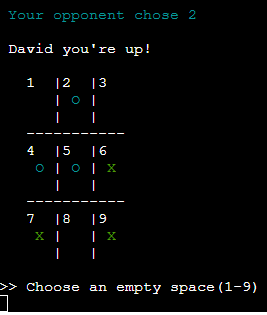
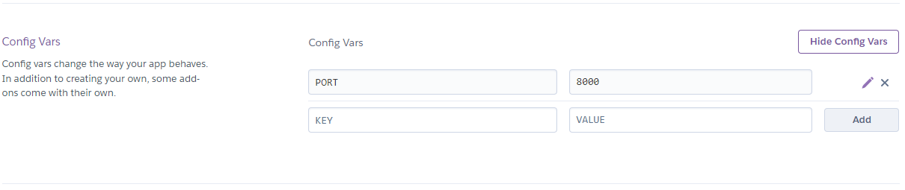
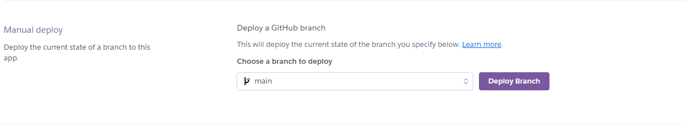

# EXO!

EXO! is a command line tic-tac-toe game written in Python.

Users take it in turns against the computer to get three of their marks in a row, each time there is a winner or a tie the score board is displayed.

LInk to my Deployed site [here in Heroku](https://exo-tictactoe-game-aa62eeed9e87.herokuapp.com/)

You are currently on the Exo! game README for [this Github repo](https://github.com/Bowlesy666/exo-game)

___

## UX

### User Stories

* Older generations looking to play an easy game to remind them of their youth
* Users wanting to play the game but do not want to waste paper
* Users wanting to play the game and have the score calculated for them each time they play
* Users who want to play the game but have no one to play with

### Target Audience

* Game is targetted at all users, young or old, looking to play an easy game

### Game Play

* You are given a display of 3 by 3 squares, total of 9
* You, the player, must give your name
* You are always player X
* The computer is always player O
* You are prompted to give your first choice of squares
* The aim of the game is to achieve three squares in a row
    * Horizontally
    * Vertically
    * Diagonally

___

### Features

#### Colorama

Shout out to my mentor Rory! He spoke to me about adding colorama to my project, I found many articles for using this library online but i used geeksforgeeks.org when it came time to implimenting it in my game.

I decided to use this subtly and not go too crazy with background colours, finding that it really helped to pop the details I wanted to draw attention to in the console.

Most interesting part was when I deployed to Heroku after implimentation... for this to work in Heroku you need to "pip3 freeze > requirements.txt" .... once I remembered this the sweating stopped!!

#### Welcome & Output Messages

Welcome and traffic light messages are imported from console_messages.py

##### Welcome message

* Welcome message lets the user know what the game is called, what the game is also more commonly known as and uses colours to highlight the different parts of the welcome message.
    * Title, Red on black, lets user know this is what to look at first
    * Sub title, Blue on black, gives more information on the game
    * Logo, Yellow on Blue, yellow on blue are extremely accessible colours and gives the fun element

##### Game End Traffic Light Messages System

* Green - Winner
* Yellow - Game Tie
* Red - Loser

Traffic light system is very intuitive, everyone already associates these colours with the intended meanings. This is displayed at the top, final gameboard in the centre and the score board at the bottom before we ask the user if they want to play again

#### Gameboard

The gameboard is a 3 x 3 square and the locations are numbered to help users with their move choices. The players mark is a green 'X' and the computers mark is a cyan coloured 'O'. The white gameboard pops off the black background and the player/computer marks are easy to distinguish and will not blurr with the gameboard or numbers

#### Scoreboard

Every time the game ends the user is presented with the winner/loser/game-tie traffic light system message, the gameboard is shown again to visually confirm the winning locations and the score board is presented below.

The score board and its title is in red and the computer/player colours and their score are kept the same as the 'X's and 'O's for continuity. This is displayed directly above asking the user to play again. i feel the whole visual gives the user the need to play again

#### Random Library

The random libraray was imported and utilised for the computers move selection. It is asked for a random integer with a range of 1 to 9

#### User Input Error Handling & Input Vaidation

##### User Name

* We validate if the name is:
    * Not blank
    * Less than 15 characters(so can fit in score board)
    * We then capitalise so at the minimum it the first letter is capitalised
    * Numbers are allowed as usernames frequently have numbers

##### User Move Selection

* We validate if the move selection is:
    * Not blank
    * An integer only
    * Not too big
    * Not too small
    * An empty space on the gameboard

In addition to these errors we also validate if the move taken is a winning/game tie move

##### Play Again Input

* We validate if the play again selection is:
    * Not blank / empty string
    * Not more characters than necessary
    * Not an incorrect character
    * is only a y or n
    * input uses .lower() method so can accep Y or N also

___

### Data Model

The Tic-Tac-Toe game uses a list-based data model to represent the game board. The "location" list holds the state of each position on the board, where each element represents a position. 

The elements can be 'X', 'O', or ' ' (empty space). The game also uses variables to track the player's score and the computer's score.

Flow chart for work flow below:

___

#### Testing

All testing has been completed on Heroku and Codeanywhere console manually. It has also been passeed through code institutes pep8 CI python linter

| Feature | Type of Test | Expected Outcome | Result | Pass/Fail |
| ------- | ------------ | ---------------- | ------ | --------- |
| Username | Correct input | Continue and display name, capitalized, with message and gameboard | displayed name, capitalized, with message and gameboard | Pass |
| Username | Blank | Error message and repeats input prompt | Error message and repeats input prompt | Pass |
| Username | input longer than 15 characters | Error message and repeats input prompt | Error message and repeats input prompt | Pass |
| User move selection | integer 1 - 9 in a known blank space | Continue with computer move and display updated gameboard | Computer move completed and displayed updated gameboard | Pass |
| User move selection | Blank | Error message and repeats input prompt | Error message and repeats input prompt | Pass |
| User move selection | String | Error message and repeats input prompt | Error message and repeats input prompt | Pass |
| User move selection | Numbers outside of gameboard range (gameboard range = 1-9) | Error message and repeats input prompt | Error message and repeats input prompt | Pass |
| User move selection | Occupied gameboard space | Error message and repeats input prompt | Error message and repeats input prompt | Pass |
| Play again input | Correct input - 'y','n','Y','N' | Exit game with thank you message or continue with reset gameboard | Exited game with thank you message or continued with resetting gameboard | Pass |
| Play again input | Blank | Error message and repeats input prompt | Error message and repeats input prompt | Pass |
| Play again input | Incorrect character | Error message and repeats input prompt | Error message and repeats input prompt | Pass |
| Play again input | Too many characters | Error message and repeats input prompt | Error message and repeats input prompt | Pass |
| Winning move | Logic run through test | Display winner message and display updated score board | Display winner message and display updated score board | Pass |
| Game tie move | Logic run through test | Display game tie message and display score board that is not updated | Display winner message and display score board that is not updated | Pass |
| Losing move | Logic run through test | Display loser message and display updated score board | Display loser message and display updated score board | Pass |

##### Bugs

After testing there are no known bugs remaining in EXO!

* I have overcome several bugs during production of Exo! I utilised the print statement method aswell as experimenting with different techniques, some bugs fixed are listed below:
    * computer move Random was giving incorrect value - print statement at each point in the function showed me to - 1 as range on board is 1 - 9 but list of locations go from 0 - 8
    * Play again input was not accepting capital Y or N. problem solving with mentor we explored many options and foind adding .lower() to the input itself worked where adding .lower() to variable afterwards at error handling stage was not
    * Colorama broke game when deploying it to Heroku(it worked in Codeanywhere), after sweating profusely I had to "pip3 freeze > requirements.txt" so colorama would be added to Heroku when deploying
    * Colroame would not work on txt files that I was extracting for welcome/win/tie/lose messages. I changed the txt file system into an library of print functions with colour.

##### Validator testing

Completed with Pep8 CI python linter on both run.py and console_messages.py

[Link for Pep8 linter](https://pep8ci.herokuapp.com/)

___

###### Deployment

If you want to crerate your own from scratch [here is the Github template](https://github.com/Code-Institute-Org/python-essentials-template)

To deploy this project:

* Fork or clone the repo - [Exo! Github repo](https://github.com/Bowlesy666/exo-game)
* create a new app in Heroku
* in Herokus new app settings add in config vars port 8000 as in the picture. If you have a creds file in your project this also goes here - key = file name and value = file contemt pasted inside

* staying in Herokus new app settings add in 2 buildpacks Python and Node.js, ensuring python is the top buildpack in the list

* in herokus deploy tab, select deployment method as github and sign in with your credentials, then paste in your github repo http address to connect your app

* I personally manually deployed the branch main and remember if you make any changes to re deploy using this button, at the end it will give you a link to your deployed project

___

###### Credits

* Idea for structure of game came from a how to video on youtube but when it came to finding it, at the time of starting the project, I couldnt. After implimenting alot of my own code I realised/remembered they had used dictionary method and I ended up using a list method for the gameboard locations. Although there's probably little similarity it helped me with where to start.
* When getting stuck/lost I turned to the web and the code institute course content, some of the sites I ended up in are as below but I probably used a lot more:
    * [geeksforgeeks.org](https://www.geeksforgeeks.org/print-colors-python-termin)
    * [Stackoverflow](https://stackoverflow.com/)
    * Google
    * [W3schools](https://www.w3schools.com/python/)
    * Youtube videos
* My mentor reviewed my code and also gave me pointers for future work
* amiresponsive?
* Colorama
* Lucidflow